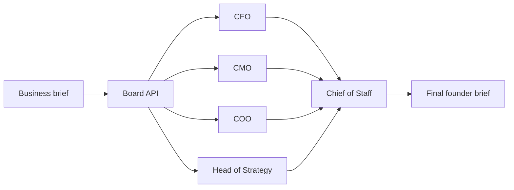

# Board Of Agents

> Four views. One clear move.

Board Of Agents is an AI-powered decision-support application that turns weekly business metrics into actionable leadership guidance. A virtual CFO, CMO, COO, and Head of Strategy analyze the same brief in parallel. A Chief of Staff then combines their perspectives into a concise executive summary while preserving meaningful disagreement.

The application is designed for founders and small business leaders who need to evaluate tradeoffs across finance, marketing, operations, and long-term strategy without losing the distinct perspective of each discipline.

## Features

- Four specialized AI advisors with distinct priorities and decision frameworks
- Parallel analysis for faster responses
- Live token streaming from every advisor
- Chief of Staff synthesis after all advisor responses finish
- Preserved dissent between advisors instead of forced consensus
- Example briefs for DTC, B2B SaaS, and local business scenarios
- Word counts, response times, and advisor availability states
- Graceful fallback mode when an OpenAI API key is not configured
- Responsive interface for desktop and mobile use
- Retry and error states for failed board sessions

## How It Works

1. The user provides an industry and the latest business metrics.
2. The browser sends the brief to `POST /api/board`.
3. The CFO, CMO, COO, and Head of Strategy analyze the brief concurrently.
4. Advisor responses stream to the browser as newline-delimited JSON.
5. The Chief of Staff receives all available advisor transcripts.
6. A final action-oriented brief is streamed back to the user.



## Advisory Board

| Advisor | Focus | Typical Questions |
| --- | --- | --- |
| CFO | Cash, margins, CAC payback, and unit economics | Can the business afford this, and what number supports it? |
| CMO | Positioning, distribution, customer insight, and creative risk | Will customers remember this, and does the channel fit the audience? |
| COO | Capacity, throughput, dependencies, and execution risk | Who will deliver this, and what is the current bottleneck? |
| Head of Strategy | Moats, competitive dynamics, and second-order effects | What does this decision enable or prevent over 12 to 36 months? |
| Chief of Staff | Prioritization and synthesis | What should the founder do next, and where does the board disagree? |

## Technology Stack

- [Next.js 16](https://nextjs.org/) with the App Router
- [React 19](https://react.dev/)
- [TypeScript](https://www.typescriptlang.org/) in strict mode
- [Tailwind CSS 4](https://tailwindcss.com/) and custom CSS
- [OpenAI Chat Completions API](https://platform.openai.com/docs/api-reference/chat)
- Streaming Web APIs using `ReadableStream`
- ESLint with Next.js Core Web Vitals and TypeScript rules

## Getting Started

### Prerequisites

- Node.js 20 or later
- npm
- An OpenAI API key for live AI analysis (optional)

### Installation

From the directory containing `package.json`, install the dependencies:

```bash
npm install
```

### Environment Variables

Create a `.env.local` file in the project directory:

```dotenv
OPENAI_API_KEY=your_openai_api_key
OPENAI_MODEL=gpt-4o-mini
```

| Variable | Required | Default | Description |
| --- | --- | --- | --- |
| `OPENAI_API_KEY` | No | None | Enables live OpenAI advisor and synthesis responses. |
| `OPENAI_MODEL` | No | `gpt-4o-mini` | Selects the OpenAI chat model used by every agent. |

Do not expose `OPENAI_API_KEY` in client-side code or commit `.env.local`. Environment files are ignored by Git.

### Run Locally

Start the development server:

```bash
npm run dev
```

Open [http://localhost:3000](http://localhost:3000) in a browser.

The application remains usable without an API key. In that mode, it streams deterministic fallback responses so the interface and end-to-end workflow can be demonstrated without making external requests.

## Available Scripts

| Command | Description |
| --- | --- |
| `npm run dev` | Starts the Next.js development server. |
| `npm run build` | Creates an optimized production build. |
| `npm run start` | Serves the production build. |
| `npm run lint` | Runs ESLint across the project. |

## API Reference

### `POST /api/board`

Starts a board session and returns a streaming NDJSON response.

#### Request Body

```json
{
	"industry": "B2B workflow software",
	"metrics": "Revenue: $184,000 MRR\nNet revenue retention: 108%"
}
```

Both properties are required, non-empty strings. Invalid JSON or missing values return an HTTP `400` response.

#### Example Request

```bash
curl -N http://localhost:3000/api/board \
	-H "Content-Type: application/json" \
	-d '{"industry":"Independent cafe","metrics":"Weekly revenue: A$31,800"}'
```

#### Stream Events

Each response line is an independent JSON object.

| Event | Purpose |
| --- | --- |
| `start` | Announces that an advisor or the final synthesis has started. |
| `delta` | Contains the next streamed text fragment. |
| `unavailable` | Marks an advisor that failed without stopping the rest of the board. |
| `done` | Marks an advisor or synthesis response as complete. |
| `complete` | Signals that the entire board session has finished. |
| `error` | Reports a session-level failure. |

Example event sequence:

```jsonl
{"type":"start","id":"cfo","label":"CFO","role":"Finance"}
{"type":"delta","id":"cfo","text":"CAC has increased..."}
{"type":"done","id":"cfo"}
{"type":"complete"}
```

The response uses `Content-Type: application/x-ndjson` and disables caching so events reach the client as they are generated.

## Project Structure

```text
app/
|-- api/board/route.ts  # Agent prompts, OpenAI integration, and NDJSON stream
|-- error.tsx           # Application-level error boundary
|-- globals.css         # Global styles and responsive interface rules
|-- layout.tsx          # Root layout, fonts, and metadata
`-- page.tsx            # Interactive board interface and stream consumer
public/                 # Static assets
eslint.config.mjs       # ESLint configuration
next.config.ts          # Next.js configuration
package.json            # Dependencies and npm scripts
tsconfig.json           # Strict TypeScript configuration
```

## Reliability and Fallback Behavior

Advisor requests run independently. If one advisor fails, the remaining advisors continue and the Chief of Staff receives an unavailable-advisor notice in place of that transcript. If final synthesis fails, the API streams a short fallback brief instead of abandoning the session.

OpenAI requests use a 10-second timeout. Individual advisor output and final synthesis are also length-limited to keep board sessions concise and predictable.

## Privacy and Security

When `OPENAI_API_KEY` is configured, the submitted industry, metrics, and generated advisor transcripts are sent to OpenAI for processing. Do not submit confidential, regulated, or personally identifiable information without reviewing the applicable data-handling requirements.

The current application does not include authentication, authorization, rate limiting, persistent storage, or an audit log. Add these controls before exposing the service to untrusted users or using it with sensitive business data.

## Deployment

The application can be deployed to any Node.js platform that supports Next.js, including Vercel.

For production deployment:

1. Configure `OPENAI_API_KEY` and, optionally, `OPENAI_MODEL` in the hosting platform.
2. Run `npm run build` to verify the production bundle.
3. Deploy the application and confirm that streaming responses are supported by the platform and any reverse proxy.
4. Add authentication, request limits, monitoring, and appropriate data-retention controls.

## Development Notes

- The client consumes partial NDJSON frames and updates each advisor independently.
- Persona prompts and synthesis rules are defined in `app/api/board/route.ts`.
- The API uses the Node.js runtime rather than the Edge runtime.
- No database is required; board sessions exist only for the duration of the request and in browser state.
- Automated tests are not currently configured. Run linting and a production build before submitting changes.

## Contributing

1. Create a focused branch for the change.
2. Keep advisor behavior, API event names, and client stream handling compatible.
3. Run `npm run lint` and `npm run build`.
4. Document new environment variables or user-facing behavior.
5. Open a pull request describing the motivation and validation performed.

## License

This project is available under the [MIT License](../LICENSE).
